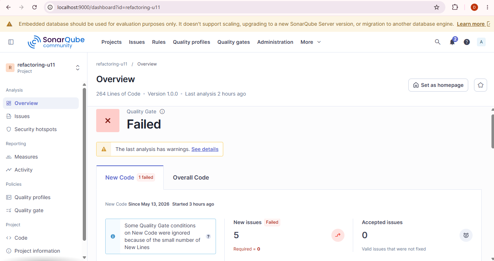

# Refactorizacion Avanzada U11 — Post 2
### MARIA JOSE CRUZ - 02230131003
## Objetivo
Reducir la complejidad de condicionales usando Strategy y Guard Clauses.

## Metricas comparativas (SonarQube)
| Metrica | Antes | Despues |
|---------|-------|---------|
| CC calcularEnvio | 3 | 1 |
| CC aprobarCredito | 6 | 2 |
| Quality Gate | Failed/Passed | Passed |

## Evidencias SonarQube

## Reflexion sobre Open/Closed
El uso de Strategy permite agregar nuevos tipos de envio creando una nueva
implementacion de `EstrategiaEnvio` sin modificar `EnvioService`. Esto mantiene
el codigo cerrado a cambios en el servicio central y abierto a extensiones a
traves de nuevas clases, reduciendo el riesgo de regresiones.

